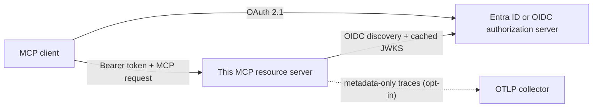

# mcp-server-auth-template

[](https://github.com/brunovicco/mcp-server-auth-template/actions/workflows/quality.yml)
[](https://github.com/brunovicco/mcp-server-auth-template/actions/workflows/compatibility.yml)
[](https://github.com/brunovicco/mcp-server-auth-template/releases)

[](LICENSE)

*[Leia em português](README.pt-BR.md)*

> A production-minded OAuth 2.1 resource-server template for remote MCP: Microsoft Entra ID and
> generic OIDC, fail-closed authorization, executable interoperability, and operational defaults
> you can inspect before adopting.

Use it to start a secure MCP server without rebuilding token validation, scope enforcement,
transport admission, observability, and deployment hygiene from scratch. It targets the MCP
**2026-07-28** reference profile and pairs with
[`mcp-client-auth-template`](https://github.com/brunovicco/mcp-client-auth-template) for a tested
end-to-end implementation.

## Why this template

- **Start from a working security boundary.** The server validates externally issued tokens; it
  never becomes an authorization server or handles user login.
- **Support enterprise and standards-based identity.** Switch between Microsoft Entra ID and a
  standards-compliant OIDC provider through configuration, without changing application code.
- **Make authorization observable and testable.** Protected Resource Metadata, OAuth challenges,
  progressive scopes, modern MCP request envelopes, and machine identity are executable contracts.
- **Ship with operational discipline.** Production preflight, structured logs, metadata-only
  tracing, health probes, hardened containers, Kubernetes examples, and graceful shutdown are
  already represented.

## Who it is for

| Audience | What they can evaluate or reuse |
| --- | --- |
| Developers | A runnable reference for OAuth-protected MCP tools, provider adapters, tests, and local setup |
| Tech leads and CTOs | Explicit trust boundaries, deployment assumptions, compatibility policy, privacy controls, and ADRs |
| Engineering reviewers and recruiters | Concrete evidence of protocol design, secure coding, strict typing, CI automation, and production thinking |

## At a glance

| Dimension | Included contract |
| --- | --- |
| MCP | Python SDK `>=2.0,<3`, protocol profile `2026-07-28`, Streamable HTTP |
| Identity | Microsoft Entra ID or generic OIDC; one authorization server per deployment |
| Authorization | Issuer, audience, signature, expiry, delegated scopes, Entra application roles, progressive scope challenges |
| Machine access | Draft MCP OAuth Client Credentials extension for the deterministic generic-OIDC profile |
| Runtime | Python 3.13/3.14, Uvicorn launcher, stateless transport, liveness/readiness probes |
| Observability | Structured logs and opt-in metadata-only W3C tracing through `a2a-otel-kit` |
| Delivery | Locked dependencies, multi-stage non-root image, Kubernetes security baseline, CI compatibility matrices |

## Where it fits



The authorization server owns login, consent, client registration, and token issuance. This
server publishes RFC 9728 Protected Resource Metadata, validates the resulting access token, maps
verified claims to a request-scoped principal, and authorizes the tool before dispatch.

## Quick start

Prerequisites: Python 3.13 or 3.14 and
[`uv`](https://docs.astral.sh/uv/getting-started/installation/).

```bash
git clone https://github.com/brunovicco/mcp-server-auth-template.git
cd mcp-server-auth-template
cp .env.example .env
uv sync --frozen --all-groups
uv run uvicorn mcp_server_auth_template.entrypoints.mcp_server:create_app --factory --reload
```

Configure either the Entra or generic-OIDC block in `.env`, then point an MCP client at
`http://localhost:8000/mcp`.

| Endpoint | Purpose | Authentication |
| --- | --- | --- |
| `/mcp` | MCP Streamable HTTP | Bearer token |
| `/.well-known/oauth-protected-resource` | Authorization-server discovery metadata | Public |
| `/livez` | Process liveness | Public, minimal response |
| `/readyz` | MCP lifespan readiness | Public, minimal response |

For production-style execution, use the explicit launcher:

```bash
uv run python -m mcp_server_auth_template.entrypoints.serve
```

See [Production operations](docs/OPERATIONS.md) before exposing the service outside loopback.

## Authentication profiles

| Profile | Intended use | Key behavior |
| --- | --- | --- |
| Entra delegated | Interactive enterprise users | Validates `scp`, tenant/application identifiers, issuer, audience, and subject |
| Entra application | Provider-specific app-only deployments | Requires explicit `idtyp=app`; keeps `roles` separate from delegated scopes |
| Generic OIDC delegated | Standards-based interactive clients | Validates issuer/audience/signature/expiry and OAuth scopes |
| Generic OIDC client credentials | Unattended services in the deterministic pair profile | Accepts pre-registered machine tokens and progressive OAuth scopes |

Set `MCP_SERVER_AUTH_PROVIDER=entra` or `generic` to switch adapters. The example `whoami` tool
returns the verified caller identity; `health` requires the additional `mcp:tools:health` scope
and demonstrates a pre-dispatch `403 insufficient_scope` challenge.

## Security posture

The implementation is deliberately fail closed:

- exact issuer and audience validation, bounded clock checks, algorithm/key compatibility, and
  cached JWKS refresh;
- hardened discovery/JWKS egress against unsafe schemes, redirects, compression, oversized
  bodies, private/reserved destinations, mixed DNS answers, and DNS rebinding;
- Host, Origin, header, envelope, body-size, and concurrency admission before authentication and
  tool dispatch;
- delegated and application identities remain distinct; extension negotiation never grants
  authorization by itself;
- bearer tokens and decoded claims remain request-local and are never logged or persisted;
- tracing excludes credentials, arbitrary headers and URLs, MCP arguments/results, bodies,
  baggage, and exception text.

This is a transparent reference implementation, not a security certification. Read
[Privacy and data handling](docs/PRIVACY.md) and the architecture decisions under
[`docs/adr/`](docs/adr/) before adapting the boundary.

## Engineering evidence

- deterministic quality gate covering lint, format, strict Mypy, architecture, tests, coverage,
  Bandit, dependency audit, and an executable supply-chain trust baseline;
- SHA-pinned GitHub Actions, read-only workflow permissions, weekly controlled updates, and
  pull-request dependency/license review;
- CycloneDX source/runtime inventories plus checksum-verified image vulnerability evidence and a
  fail-closed, time-bounded exception gate;
- Python 3.13/3.14 against MCP SDK 2.0.0 and the latest compatible 2.x;
- Entra/generic OIDC across production HTTPS and explicit IPv4/IPv6 loopback profiles;
- canonical cross-repository contract plus a real 12-scenario OAuth/MCP E2E suite owned by the
  companion client;
- offline JWT fixtures: unit and contract tests use local keys and synthetic identities, never a
  production IdP or real credential;
- ADRs document security, protocol, operations, compatibility, and observability decisions.

## Observability

`a2a-otel-kit` continues W3C trace context at the MCP ASGI boundary. Export is network-silent
unless explicitly enabled with `A2A_OTEL_ENABLED=true` and a complete OTLP traces endpoint. Spans
are metadata-only and sit inside hardened HTTP admission but outside authentication and tool
dispatch. See [LLM and application observability](docs/LLM_OBSERVABILITY.md).

## Documentation map

| Document | Use it for |
| --- | --- |
| [Architecture](docs/ARCHITECTURE.md) | Context, layers, dependency rules, and request sequence |
| [Compatibility](docs/COMPATIBILITY.md) | Supported versions and executable client/server contract |
| [Operations](docs/OPERATIONS.md) | Preflight, probes, shutdown, containers, and Kubernetes |
| [Privacy](docs/PRIVACY.md) | Data inventory, retention, logging, tracing, and external processors |
| [Supply chain](docs/SUPPLY_CHAIN.md) | Dependency policy, CI trust boundary, threats, and exceptions |
| [Observability](docs/LLM_OBSERVABILITY.md) | OpenTelemetry and optional Langfuse configuration |
| [Development](docs/DEVELOPMENT.md) | Local environment, checks, and container workflow |
| [Architecture decisions](docs/adr/) | Rationale and trade-offs behind material decisions |

## Development

```bash
uv lock --check
uv sync --frozen --all-groups
uv run pytest
uv run python scripts/quality_gate.py
```

The quality gate is the definition of done. Use `--list` or `--check NAME` for focused local
feedback, then run the complete gate before opening a pull request.

## Scope and production adoption

This repository is a reference template, not a hosted identity service. A concrete deployment
must still provide TLS termination, immutable image publishing, secret delivery, provider-specific
registration, network policy, capacity planning, monitoring ownership, and live IdP validation.
The checked-in `.invalid` and all-zero values are placeholders and fail production preflight.

## License

[MIT](LICENSE)
