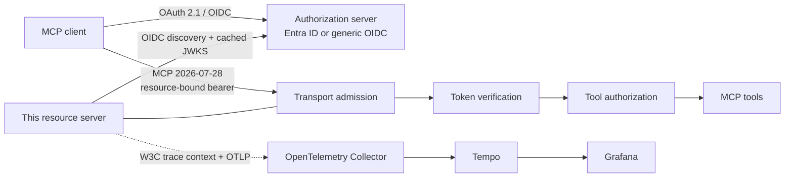

# mcp-server-auth-template

[](https://github.com/brunovicco/mcp-server-auth-template/actions/workflows/quality.yml)
[](https://github.com/brunovicco/mcp-server-auth-template/actions/workflows/compatibility.yml)
[](https://github.com/brunovicco/mcp-server-auth-template/releases)

[](LICENSE)

*[Leia em português](README.pt-BR.md)*

> A production-oriented OAuth 2.1 resource-server reference for remote MCP: Microsoft Entra ID and
> generic OIDC, exact token/resource validation, fail-closed authorization, progressive scope
> challenges, stateless MCP `2026-07-28`, and metadata-only OpenTelemetry evidence.

Use this repository when the hard part is not "how do I expose an MCP tool?" but **how do I expose
it without weakening identity, authorization, transport, and observability boundaries**. The server
pairs with [`mcp-client-auth-template`](https://github.com/brunovicco/mcp-client-auth-template) for
an executable end-to-end reference using synthetic identities and no production credentials.

## What this repository proves

The paired executable path validates real resource-server behavior rather than configuration claims:

- ✅ RFC 9728 Protected Resource Metadata is published by the resource server
- ✅ RFC 8707 resource binding becomes an exact JWT audience boundary
- ✅ issuer, signature, expiry, algorithm/key compatibility and caller type fail closed
- ✅ delegated scopes and Entra application roles remain distinct authorization concepts
- ✅ `403 insufficient_scope` is returned before dispatch for progressive authorization
- ✅ wrong-audience tokens are rejected with `401`
- ✅ protected tools stay hidden from anonymous catalog discovery
- ✅ MCP `2026-07-28` stays stateless and does not mint `Mcp-Session-Id`
- ✅ generic OIDC and Microsoft Entra ID share one application boundary without provider leakage
- ✅ W3C trace context reaches the server while OAuth/MCP sensitive values stay out of telemetry
- ✅ release artifacts, container evidence, SBOMs and provenance are validated by executable gates

For a requirement-by-requirement view of the paired OAuth/MCP behavior, including explicit evidence
gaps and discussion topics for the MCP Authorization Interest Group / Tool Scopes Working Group, see
the [Authorization Implementer Report](docs/AUTHORIZATION_IMPLEMENTER_REPORT.md).

## Architecture



The authorization server owns login, consent, client registration and token issuance. This
repository owns the protected resource: transport admission, metadata publication, access-token
verification, request-scoped principal construction, tool authorization and dispatch.

For layer boundaries and the detailed authorization sequence, see
[Architecture](docs/ARCHITECTURE.md).

## 5-minute verification

The companion client owns the executable cross-repository reference flow. With both repositories
cloned as siblings, verify this server directly from source:

```bash
cd ../mcp-client-auth-template
./scripts/run_reference_demo.sh \
  --server-root ../mcp-server-auth-template
```

The flow starts the real server from this checkout plus a deterministic local OIDC provider and
proves CIMD-first Authorization Code + PKCE, authenticated `whoami`, bounded scope step-up,
wrong-audience rejection and stateless MCP behavior.

For the observable published-image proof:

```bash
cd ../mcp-client-auth-template
./scripts/run_observability_demo.sh --keep
```

The observable flow verifies one distributed trace across client and server, positive Collector
receipt, Tempo retrieval, Grafana provisioning and telemetry privacy assertions.

See [Verification guide](docs/VERIFICATION.md) for the exact evidence boundary.

### Visual proof

The terminal proof below is captured from the source-level paired reference flow:


The trace screenshots are captured from a successful observable run and focus on
`mcp-server-auth-template` spans:


## Authentication profiles

| Profile | Intended use | Key behavior |
| --- | --- | --- |
| Entra delegated | Interactive enterprise users | Validates `scp`, tenant/application identifiers, issuer, audience and subject |
| Entra application | Provider-specific app-only deployments | Requires explicit `idtyp=app`; keeps `roles` separate from delegated scopes |
| Generic OIDC delegated | Standards-based interactive clients | Validates issuer/audience/signature/expiry and OAuth scopes |
| Generic OIDC client credentials | Unattended services in the deterministic pair profile | Accepts pre-registered machine tokens and progressive OAuth scopes |

Set `MCP_SERVER_AUTH_PROVIDER=entra` or `generic` to switch adapters. The example `whoami` tool
returns the verified caller identity; `health` requires the additional `mcp:tools:health` scope and
demonstrates a pre-dispatch `403 insufficient_scope` challenge.

## Quick start

Prerequisites: Python 3.13 or 3.14 and
[`uv`](https://docs.astral.sh/uv/getting-started/installation/).

```bash
git clone https://github.com/brunovicco/mcp-server-auth-template.git
cd mcp-server-auth-template
cp .env.example .env
uv sync --frozen --all-groups
uv run uvicorn mcp_server_auth_template.entrypoints.mcp_server:create_app --factory --reload
```

Configure either the Entra or generic-OIDC block in `.env`, then point an MCP client at
`http://localhost:8000/mcp`.

| Endpoint | Purpose | Authentication |
| --- | --- | --- |
| `/mcp` | MCP Streamable HTTP | Bearer token |
| `/.well-known/oauth-protected-resource` | Authorization-server discovery metadata | Public |
| `/livez` | Process liveness | Public, minimal response |
| `/readyz` | MCP lifespan readiness | Public, minimal response |

For production-style execution:

```bash
uv run python -m mcp_server_auth_template.entrypoints.serve
```

See [Production operations](docs/OPERATIONS.md) before exposing the service outside loopback.

## Official MCP Registry readiness

P2.1 prepares this repository for the Official MCP Registry namespace
`io.github.brunovicco/mcp-server-auth-template`. `server.json` describes the public GHCR image as
an OCI package using the real `streamable-http` transport; it does not claim a hosted `remotes`
endpoint. Version `0.6.1` is reserved as the first immutable image version carrying the required
`io.modelcontextprotocol.server.name` ownership label.

Registry publication is deliberately separate from this readiness change and happens only after the
secure release pipeline validates the final OCI index. See [Official MCP Registry](docs/REGISTRY.md).

## Security properties

The implementation is deliberately fail closed:

- exact issuer and audience validation, bounded clock checks, algorithm/key compatibility and
  cached JWKS refresh;
- hardened discovery/JWKS egress against unsafe schemes, redirects, compression, oversized bodies,
  private/reserved destinations, mixed DNS answers and DNS rebinding;
- Host, Origin, header, envelope, body-size and concurrency admission before authentication and tool
  dispatch;
- delegated and application identities remain distinct; extension negotiation never grants
  authorization by itself;
- bearer tokens and decoded claims remain request-local and are never logged or persisted;
- tracing excludes credentials, arbitrary headers and URLs, MCP arguments/results, bodies, baggage
  and exception text.

This is a transparent reference implementation, not a security certification. Read
[Privacy and data handling](docs/PRIVACY.md) and the architecture decisions under
[`docs/adr/`](docs/adr/) before adapting the boundary.

## MCP `2026-07-28`

The paired templates exercise the modern stateless profile as executable behavior:

- `server/discover` and per-request `_meta` carry protocol version, client identity and capabilities
  without the legacy `initialize` / `initialized` handshake;
- modern requests use `MCP-Protocol-Version`, `Mcp-Method` and `Mcp-Name`;
- responses do not mint `Mcp-Session-Id`;
- Protected Resource Metadata drives authorization-server discovery;
- RFC 8707 `resource` binds the access token audience exactly;
- runtime `403 insufficient_scope` preserves prior grants and permits only one bounded replay of
  the undispatched operation;
- machine-to-machine access is opt-in through
  `io.modelcontextprotocol/oauth-client-credentials`.

See [Compatibility](docs/COMPATIBILITY.md) and the companion client's
[cross-repository E2E evidence](https://github.com/brunovicco/mcp-client-auth-template/blob/main/docs/E2E.md).

## Observability

`a2a-otel-kit` continues W3C trace context at the MCP ASGI boundary. Export remains network-silent
unless `A2A_OTEL_ENABLED=true` and a complete OTLP traces endpoint are configured. Spans are
metadata-only and sit inside hardened HTTP admission but outside authentication and tool dispatch.

See [LLM and application observability](docs/LLM_OBSERVABILITY.md).

## Engineering evidence

- deterministic quality gate covering lint, format, strict Mypy, architecture, tests/coverage,
  Bandit, dependency audit, supply-chain controls, governance and vendored contract validation;
- SHA-pinned GitHub Actions with read-only permissions by default and isolated release authorities;
- CycloneDX source/runtime inventories, complete vulnerability evidence and fail-closed exception
  policy;
- allowlisted byte-reproducible Python release artifacts with SHA-256 manifests and GitHub build
  provenance;
- policy-approved GHCR publication with immutable digest, provenance and SBOM attestations;
- Python 3.13/3.14 against MCP SDK 2.0.0 and latest compatible 2.x;
- offline JWT fixtures using local keys and synthetic identities;
- ADRs documenting security, protocol, operations, compatibility, observability and supply-chain
  decisions.

## Demo vs production

| Reference evidence | Production adoption |
| --- | --- |
| Synthetic local OIDC in companion demo | Enterprise authorization server with reviewed registration and consent |
| Loopback/local reference networking | TLS-protected service networking and explicit proxy ownership |
| Local Collector/Tempo/Grafana | Organization-managed telemetry pipeline and retention policy |
| Synthetic signing keys and identities | Managed keys, secrets and provider-specific controls |
| Reference `whoami` / `health` tools | Domain tools with explicit authorization policies and side-effect controls |

The reference settings prove boundaries; they are not production defaults.

## Repository structure

```text
src/                    resource-server implementation
tests/                  unit, contract and security evidence
scripts/                quality, governance and release automation
docs/                   architecture, operations, privacy and security
examples/                deployment/reference configuration
.github/workflows/      CI, compatibility and release workflows
```

Local editor and coding-agent state is intentionally excluded from the public repository.

## Documentation

| Document | Use it for |
| --- | --- |
| [Verification](docs/VERIFICATION.md) | Source-level and observable paired proof |
| [Architecture](docs/ARCHITECTURE.md) | Context, layers, dependency rules and request sequence |
| [Compatibility](docs/COMPATIBILITY.md) | Supported versions and executable client/server contract |
| [Operations](docs/OPERATIONS.md) | Preflight, probes, shutdown, containers and Kubernetes |
| [Privacy](docs/PRIVACY.md) | Data inventory, retention, logging, tracing and external processors |
| [Supply chain](docs/SUPPLY_CHAIN.md) | Dependency policy, CI trust boundary, threats and exceptions |
| [Observability](docs/LLM_OBSERVABILITY.md) | OpenTelemetry and optional Langfuse configuration |
| [Development](docs/DEVELOPMENT.md) | Local environment, checks and container workflow |
| [Architecture decisions](docs/adr/) | Rationale and trade-offs behind material decisions |

## Testing and quality

```bash
uv lock --check
uv sync --frozen --all-groups
uv run pytest
uv run python scripts/quality_gate.py
```

The quality gate is the definition of done. It covers lint, format, architecture, strict typing,
tests/coverage, Bandit, dependency audit, supply-chain controls, governance and vendored contract
validation.

## Scope and production adoption

This repository is a reference template, not a hosted identity service. A concrete deployment must
still provide TLS termination, immutable image publishing, secret delivery, provider-specific
registration, network policy, capacity planning, monitoring ownership and live IdP validation.
Checked-in `.invalid` and all-zero values are placeholders and fail production preflight.

## License

[MIT](LICENSE)
