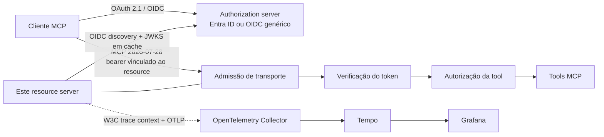
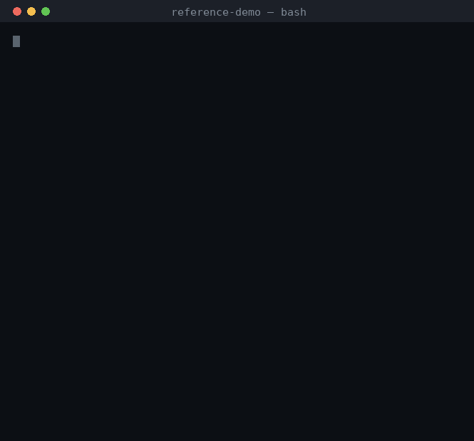
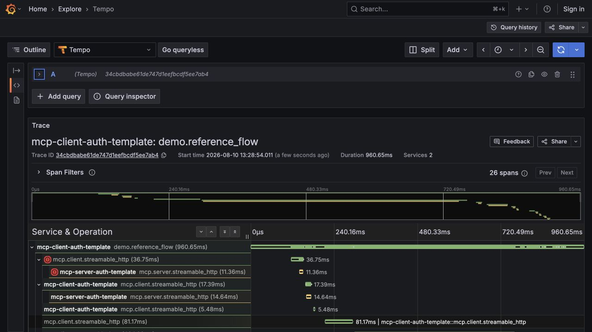
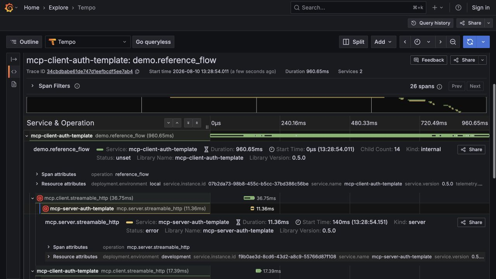

# mcp-server-auth-template

[](https://github.com/brunovicco/mcp-server-auth-template/actions/workflows/quality.yml)
[](https://github.com/brunovicco/mcp-server-auth-template/actions/workflows/compatibility.yml)
[](https://github.com/brunovicco/mcp-server-auth-template/releases)

[](LICENSE)

*[Read in English](README.md)*

> Uma referência de resource server OAuth 2.1 orientada a produção para MCP remoto: Microsoft Entra
> ID e OIDC genérico, validação exata de token/resource, autorização fail-closed, desafios
> progressivos de scope, MCP stateless `2026-07-28` e evidência OpenTelemetry apenas de metadados.

Use este repositório quando a parte difícil não for "como expor uma tool MCP?", mas **como expô-la
sem enfraquecer as fronteiras de identidade, autorização, transporte e observabilidade**. O server
forma um par com
[`mcp-client-auth-template`](https://github.com/brunovicco/mcp-client-auth-template), que fornece a
referência ponta a ponta executável usando identidades sintéticas e sem credenciais de produção.

## O que este repositório comprova

O fluxo executável do par valida comportamento real do resource server, e não apenas configuração:

- ✅ publica Protected Resource Metadata conforme RFC 9728
- ✅ transforma o `resource` da RFC 8707 em uma fronteira exata de audience do JWT
- ✅ issuer, assinatura, expiração, algoritmo/chave e tipo do chamador falham de forma fechada
- ✅ scopes delegados e application roles do Entra permanecem conceitos distintos
- ✅ retorna `403 insufficient_scope` antes do dispatch para autorização progressiva
- ✅ rejeita token com audience incorreta com `401`
- ✅ mantém tools protegidas fora do catálogo anônimo
- ✅ mantém MCP `2026-07-28` stateless, sem emitir `Mcp-Session-Id`
- ✅ suporta OIDC genérico e Microsoft Entra ID sem vazar detalhes do provider para a aplicação
- ✅ continua W3C Trace Context sem colocar valores sensíveis de OAuth/MCP na telemetria
- ✅ valida artifacts, imagem, SBOMs e provenance por gates executáveis

Para uma visão requisito a requisito do comportamento OAuth/MCP do par, incluindo lacunas explícitas
de evidência e tópicos para o Authorization Interest Group / Tool Scopes Working Group do MCP, veja o
[Authorization Implementer Report](docs/AUTHORIZATION_IMPLEMENTER_REPORT.md).

## Arquitetura



O authorization server controla login, consentimento, registro do cliente e emissão de tokens. Este
repositório controla o recurso protegido: admissão de transporte, publicação de metadados,
verificação do access token, construção do principal por requisição, autorização e dispatch.

Veja [Arquitetura](docs/ARCHITECTURE.md) para as camadas e a sequência detalhada.

## Verificação em 5 minutos

O client companheiro é o dono do fluxo executável entre os dois repositórios. Com ambos clonados
como diretórios irmãos, valide este server diretamente do código-fonte:

```bash
cd ../mcp-client-auth-template
./scripts/run_reference_demo.sh \
  --server-root ../mcp-server-auth-template
```

O fluxo inicia o server real deste checkout mais um OIDC local determinístico e comprova
Authorization Code + PKCE com CIMD-first, `whoami` autenticado, step-up limitado, rejeição de
audience incorreta e comportamento MCP stateless.

Para a evidência observável usando a imagem publicada:

```bash
cd ../mcp-client-auth-template
./scripts/run_observability_demo.sh --keep
```

O fluxo observável verifica um único trace distribuído entre client e server, recebimento positivo
no Collector, consulta no Tempo, provisioning do Grafana e assertions de privacidade da telemetria.

Veja o [Guia de verificação](docs/VERIFICATION.pt-BR.md) para a fronteira exata da evidência.

### Evidência visual

O terminal abaixo é capturado do fluxo do par executando o server diretamente do código-fonte:



As telas de trace são capturadas de uma execução observável bem-sucedida, com foco nos spans de
`mcp-server-auth-template`:





## Perfis de autenticação

| Perfil | Uso indicado | Comportamento principal |
| --- | --- | --- |
| Entra delegado | Usuários corporativos interativos | Valida `scp`, tenant/aplicação, issuer, audience e subject |
| Entra aplicação | Deployments app-only específicos do provider | Exige `idtyp=app`; mantém `roles` separados de scopes delegados |
| OIDC genérico delegado | Clientes interativos baseados em padrões | Valida issuer/audience/assinatura/expiração e scopes OAuth |
| Client credentials OIDC genérico | Serviços sem usuário no perfil determinístico do par | Aceita tokens de máquina pré-registrada e scopes OAuth progressivos |

Defina `MCP_SERVER_AUTH_PROVIDER=entra` ou `generic` para trocar de adapter. A tool `whoami` retorna
a identidade verificada; `health` exige o scope adicional `mcp:tools:health` e demonstra
`403 insufficient_scope` antes do dispatch.

## Início rápido

Pré-requisitos: Python 3.13 ou 3.14 e
[`uv`](https://docs.astral.sh/uv/getting-started/installation/).

```bash
git clone https://github.com/brunovicco/mcp-server-auth-template.git
cd mcp-server-auth-template
cp .env.example .env
uv sync --frozen --all-groups
uv run uvicorn mcp_server_auth_template.entrypoints.mcp_server:create_app --factory --reload
```

Configure o bloco do Entra ou OIDC genérico no `.env` e aponte o cliente para
`http://localhost:8000/mcp`.

| Endpoint | Finalidade | Autenticação |
| --- | --- | --- |
| `/mcp` | MCP Streamable HTTP | Bearer token |
| `/.well-known/oauth-protected-resource` | Descoberta do authorization server | Público |
| `/livez` | Liveness | Público, resposta mínima |
| `/readyz` | Readiness do lifespan MCP | Público, resposta mínima |

Para execução no estilo de produção:

```bash
uv run python -m mcp_server_auth_template.entrypoints.serve
```

Leia [Operações](docs/OPERATIONS.md) antes de expor o serviço fora de loopback.

## Preparação para o Official MCP Registry

O P2.1 prepara este repositório para o namespace
`io.github.brunovicco/mcp-server-auth-template` no Official MCP Registry. O `server.json` descreve a
imagem pública do GHCR como pacote OCI usando o transporte real `streamable-http`; ele não declara
um endpoint hospedado em `remotes`. A versão `0.6.1` fica reservada como a primeira versão imutável
da imagem com o label de ownership `io.modelcontextprotocol.server.name` exigido pelo Registry.

A publicação no Registry continua separada desta mudança de readiness e só acontece depois que o
pipeline seguro validar o OCI index final. Veja [Official MCP Registry](docs/REGISTRY.pt-BR.md).

## Propriedades de segurança

A implementação é intencionalmente fail-closed:

- validação exata de issuer e audience, limites de relógio, compatibilidade de algoritmo/chave e
  refresh de JWKS em cache;
- egress endurecido para discovery/JWKS contra esquemas inseguros, redirects, compressão, corpos
  grandes, destinos privados/reservados, respostas DNS mistas e DNS rebinding;
- admissão de Host, Origin, headers, envelope, tamanho do corpo e concorrência antes da autenticação
  e do dispatch;
- identidades delegadas e de aplicação permanecem distintas;
- bearer tokens e claims decodificadas ficam restritos à requisição e não são logados/persistidos;
- tracing exclui credenciais, headers/URLs arbitrários, argumentos/resultados MCP, bodies, baggage
  e texto de exceções.

Esta é uma implementação de referência, não uma certificação de segurança. Leia
[Privacidade](docs/PRIVACY.md) e as decisões em [`docs/adr/`](docs/adr/).

## MCP `2026-07-28`

O par de templates exercita o perfil moderno stateless como comportamento executável:

- `server/discover` e `_meta` por requisição carregam versão, identidade e capacidades sem o
  handshake legado `initialize` / `initialized`;
- requisições modernas usam `MCP-Protocol-Version`, `Mcp-Method` e `Mcp-Name`;
- as respostas não emitem `Mcp-Session-Id`;
- Protected Resource Metadata conduz o discovery;
- RFC 8707 `resource` vincula exatamente a audience do access token;
- `403 insufficient_scope` preserva grants existentes e permite apenas um replay limitado da
  operação ainda não executada;
- acesso máquina-a-máquina é opt-in por
  `io.modelcontextprotocol/oauth-client-credentials`.

Veja [Compatibilidade](docs/COMPATIBILITY.md) e as
[evidências E2E do client](https://github.com/brunovicco/mcp-client-auth-template/blob/main/docs/E2E.md).

## Observabilidade

O `a2a-otel-kit` continua W3C Trace Context na fronteira ASGI MCP. O export é silencioso em rede a
menos que `A2A_OTEL_ENABLED=true` e um endpoint OTLP completo sejam configurados. Os spans contêm
somente metadados e ficam dentro da admissão HTTP endurecida, mas fora da autenticação e dispatch.

Veja [Observabilidade](docs/LLM_OBSERVABILITY.md).

## Evidências de engenharia

- quality gate determinístico com lint, format, Mypy estrito, arquitetura, testes/cobertura,
  Bandit, auditoria de dependências, supply chain, governança e contratos vendorizados;
- GitHub Actions fixadas por SHA e permissões somente leitura por padrão;
- inventários CycloneDX, relatório completo de vulnerabilidades e política fail-closed de exceções;
- artifacts Python allowlisted e reprodutíveis byte a byte com SHA-256 e build provenance;
- publicação GHCR aprovada por política com digest imutável, provenance e SBOM attestations;
- Python 3.13/3.14 contra MCP SDK 2.0.0 e 2.x compatível mais recente;
- fixtures JWT offline com chaves locais e identidades sintéticas;
- ADRs para decisões de segurança, protocolo, operação, compatibilidade, observabilidade e
  supply chain.

## Demo vs produção

| Evidência de referência | Adoção em produção |
| --- | --- |
| OIDC local sintético no client companheiro | Authorization server corporativo com registro/consentimento revisados |
| Networking local/loopback | Rede de serviços protegida por TLS e ownership explícito de proxy |
| Collector/Tempo/Grafana locais | Pipeline corporativo de telemetria e política de retenção |
| Chaves e identidades sintéticas | Chaves/segredos gerenciados e controles específicos do provider |
| Tools `whoami` / `health` | Tools de domínio com políticas explícitas e controle de efeitos colaterais |

As configurações de referência comprovam fronteiras; não são defaults de produção.

## Estrutura do repositório

```text
src/                    implementação do resource server
tests/                  evidências unitárias, de contrato e segurança
scripts/                automação de qualidade, governança e release
docs/                   arquitetura, operações, privacidade e segurança
examples/                configuração/deployment de referência
.github/workflows/      CI, compatibilidade e release
```

Estado local de editores e coding agents é deliberadamente excluído do repositório público.

## Documentação

| Documento | Quando usar |
| --- | --- |
| [Verificação](docs/VERIFICATION.pt-BR.md) | Prova do par por source e observabilidade |
| [Arquitetura](docs/ARCHITECTURE.md) | Contexto, camadas, dependências e sequência |
| [Compatibilidade](docs/COMPATIBILITY.md) | Versões e contrato executável client/server |
| [Operações](docs/OPERATIONS.md) | Preflight, probes, shutdown, containers e Kubernetes |
| [Privacidade](docs/PRIVACY.md) | Dados, retenção, logs, tracing e processadores externos |
| [Supply chain](docs/SUPPLY_CHAIN.pt-BR.md) | Dependências, confiança no CI, ameaças e exceções |
| [Observabilidade](docs/LLM_OBSERVABILITY.md) | OpenTelemetry e Langfuse opcional |
| [Desenvolvimento](docs/DEVELOPMENT.md) | Ambiente local, checks e container |
| [Decisões](docs/adr/) | Justificativas e trade-offs |

## Testes e qualidade

```bash
uv lock --check
uv sync --frozen --all-groups
uv run pytest
uv run python scripts/quality_gate.py
```

O quality gate é a definição de pronto e cobre lint, format, arquitetura, tipagem estrita,
testes/cobertura, Bandit, auditoria de dependências, supply chain, governança e contratos
vendorizados.

## Escopo e adoção em produção

Este repositório é um template de referência, não um serviço de identidade hospedado. Um deployment
real ainda deve fornecer terminação TLS, publicação de imagem imutável, entrega de secrets,
registro no provider, network policy, capacidade, ownership de monitoramento e validação real com o
IdP. Valores `.invalid` e identificadores zerados são placeholders e falham no preflight.

## Licença

[MIT](LICENSE)
