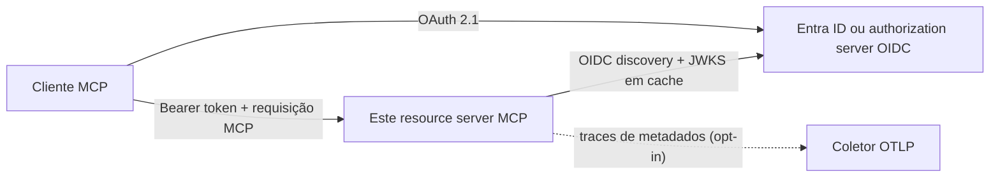

# mcp-server-auth-template

[](https://github.com/brunovicco/mcp-server-auth-template/actions/workflows/quality.yml)
[](https://github.com/brunovicco/mcp-server-auth-template/actions/workflows/compatibility.yml)
[](https://github.com/brunovicco/mcp-server-auth-template/releases)

[](LICENSE)

*[Read in English](README.md)*

> Um template de resource server OAuth 2.1 para MCP remoto, pensado para produção: Microsoft Entra
> ID e OIDC genérico, autorização fail-closed, interoperabilidade executável e padrões operacionais
> que podem ser auditados antes da adoção.

Use este projeto para começar um servidor MCP seguro sem reconstruir do zero validação de tokens,
enforcement de scopes, admissão de transporte, observabilidade e higiene de deployment. O alvo é o
perfil de referência MCP **2026-07-28**, em conjunto com o
[`mcp-client-auth-template`](https://github.com/brunovicco/mcp-client-auth-template) para uma
implementação ponta a ponta testada.

## Por que este template existe

- **Comece por uma fronteira de segurança funcional.** O servidor valida tokens emitidos
  externamente; ele nunca se transforma em authorization server nem controla o login do usuário.
- **Atenda identidade corporativa e baseada em padrões.** Alterne entre Microsoft Entra ID e um
  provider OIDC compatível por configuração, sem mudar o código da aplicação.
- **Torne a autorização observável e testável.** Protected Resource Metadata, desafios OAuth,
  scopes progressivos, envelopes MCP modernos e identidade de máquina são contratos executáveis.
- **Inclua disciplina operacional desde o início.** Preflight de produção, logs estruturados,
  tracing apenas de metadados, health probes, container endurecido, exemplos Kubernetes e shutdown
  gracioso já estão representados.

## Para quem é

| Público | O que pode avaliar ou reutilizar |
| --- | --- |
| Desenvolvedores | Uma referência executável para tools MCP protegidas por OAuth, adapters, testes e setup local |
| Tech leads e CTOs | Fronteiras de confiança explícitas, premissas de deployment, compatibilidade, privacidade e ADRs |
| Revisores técnicos e recrutadores | Evidências concretas de design de protocolos, segurança, tipagem estrita, automação de CI e visão de produção |

## Visão rápida

| Dimensão | Contrato incluído |
| --- | --- |
| MCP | Python SDK `>=2.0,<3`, perfil `2026-07-28`, Streamable HTTP |
| Identidade | Microsoft Entra ID ou OIDC genérico; um authorization server por deployment |
| Autorização | Issuer, audience, assinatura, expiração, scopes delegados, app roles do Entra e desafios progressivos |
| Acesso de máquina | Extensão oficial e opcional MCP OAuth Client Credentials no perfil determinístico OIDC genérico |
| Runtime | Python 3.13/3.14, launcher Uvicorn, transporte stateless e probes de liveness/readiness |
| Observabilidade | Logs estruturados e tracing W3C apenas de metadados via `a2a-otel-kit` |
| Entrega | Dependências travadas, imagem multi-stage non-root, baseline Kubernetes e matrizes de CI |

## Onde ele se encaixa



O authorization server controla login, consentimento, registro do cliente e emissão de tokens.
Este servidor publica Protected Resource Metadata RFC 9728, valida o access token resultante,
mapeia claims verificadas para um principal restrito à requisição e autoriza a tool antes do
dispatch.

## Início rápido

Pré-requisitos: Python 3.13 ou 3.14 e
[`uv`](https://docs.astral.sh/uv/getting-started/installation/).

```bash
git clone https://github.com/brunovicco/mcp-server-auth-template.git
cd mcp-server-auth-template
cp .env.example .env
uv sync --frozen --all-groups
uv run uvicorn mcp_server_auth_template.entrypoints.mcp_server:create_app --factory --reload
```

Configure o bloco do Entra ou do OIDC genérico no `.env` e aponte um cliente MCP para
`http://localhost:8000/mcp`.

| Endpoint | Finalidade | Autenticação |
| --- | --- | --- |
| `/mcp` | MCP Streamable HTTP | Bearer token |
| `/.well-known/oauth-protected-resource` | Metadados para descoberta do authorization server | Público |
| `/livez` | Liveness do processo | Público, resposta mínima |
| `/readyz` | Readiness do lifespan MCP | Público, resposta mínima |

Para uma execução no estilo de produção, use o launcher explícito:

```bash
uv run python -m mcp_server_auth_template.entrypoints.serve
```

Leia [Operações de produção](docs/OPERATIONS.md) antes de expor o serviço fora de loopback.

## Perfis de autenticação

| Perfil | Uso indicado | Comportamento principal |
| --- | --- | --- |
| Entra delegado | Usuários corporativos interativos | Valida `scp`, identificadores de tenant/aplicação, issuer, audience e subject |
| Entra aplicação | Deployments app-only específicos do provider | Exige `idtyp=app`; mantém `roles` separados dos scopes delegados |
| OIDC genérico delegado | Clientes interativos baseados em padrões | Valida issuer/audience/assinatura/expiração e scopes OAuth |
| Client credentials OIDC genérico | Serviços sem usuário no perfil determinístico do par | Aceita tokens de máquina pré-registrada e scopes OAuth progressivos |

Defina `MCP_SERVER_AUTH_PROVIDER=entra` ou `generic` para trocar de adapter. A tool de exemplo
`whoami` retorna a identidade verificada do chamador; `health` exige o scope adicional
`mcp:tools:health` e demonstra um desafio `403 insufficient_scope` antes do dispatch.

## Postura de segurança

A implementação é intencionalmente fail-closed:

- validação exata de issuer e audience, limites de tempo, compatibilidade de algoritmo/chave e
  refresh de JWKS em cache;
- egress endurecido para discovery/JWKS contra esquemas inseguros, redirects, compressão, corpos
  grandes, destinos privados/reservados, respostas DNS mistas e DNS rebinding;
- admissão de Host, Origin, headers, envelope, tamanho do corpo e concorrência antes da autenticação
  e do dispatch da tool;
- identidades delegadas e de aplicação permanecem distintas; negociar uma extensão nunca concede
  autorização por si só;
- bearer tokens e claims decodificadas ficam restritos à requisição e nunca são logados ou
  persistidos;
- o tracing exclui credenciais, headers e URLs arbitrários, argumentos/resultados MCP, bodies,
  baggage e texto de exceções.

Esta é uma implementação de referência transparente, não uma certificação de segurança. Leia
[Privacidade e tratamento de dados](docs/PRIVACY.md) e as decisões em
[`docs/adr/`](docs/adr/) antes de adaptar a fronteira.

## Evidências de engenharia

- quality gate determinístico com lint, format, Mypy estrito, arquitetura, testes, cobertura,
  Bandit, auditoria de dependências e baseline executável de confiança da supply chain;
- GitHub Actions fixadas por SHA, permissões somente leitura por padrão, escritas de release
  isoladas e com privilégio mínimo, updates semanais controlados e revisão de
  dependências/licenças nos pull requests;
- inventários CycloneDX de código/runtime, evidência de vulnerabilidades da imagem com checksum e
  gate fail-closed para exceções temporárias;
- artifacts Python de release com allowlist, reprodução byte a byte, manifestos SHA-256 e
  attestations de build provenance do GitHub;
- workflow de publicação controlado por tag que produz GitHub Releases com evidência completa
  de integridade e attestations CycloneDX, e publica a imagem GHCR aprovada pela política com
  provenance e verificação por digest imutável;
- Python 3.13/3.14 contra MCP SDK 2.0.0 e a versão 2.x compatível mais recente;
- Entra/OIDC genérico em HTTPS de produção e perfis locais IPv4/IPv6 explicitamente habilitados;
- contrato canônico entre repositórios e suíte OAuth/MCP E2E real de 12 cenários mantida pelo
  cliente companheiro;
- fixtures JWT offline: testes unitários e de contrato usam chaves locais e identidades sintéticas,
  nunca um IdP de produção ou credencial real;
- ADRs documentam decisões de segurança, protocolo, operações, compatibilidade e observabilidade.

## Evidências de conformidade com MCP 2026-07-28

Os templates em conjunto exercitam o perfil MCP stateless atual como comportamento executável, em
vez de depender apenas de uma declaração de versão:

- `server/discover` e `_meta` por requisição carregam versão do protocolo, identidade e capacidades
  do cliente sem o handshake legado `initialize`/`initialized`;
- requisições modernas usam `MCP-Protocol-Version`, `Mcp-Method` e `Mcp-Name`; as respostas não
  emitem `Mcp-Session-Id`;
- Protected Resource Metadata RFC 9728 conduz o discovery do authorization server;
- o vínculo `resource` da RFC 8707 é exercitado nas requisições de autorização e token, e o servidor
  valida exatamente a audience resultante no JWT;
- OIDC genérico usa CIMD primeiro e mantém DCR apenas como fallback de compatibilidade, enquanto a
  resposta de autorização valida `iss` conforme RFC 9207 antes de resgatar o code;
- desafios `403 insufficient_scope` em runtime preservam grants anteriores, solicitam o conjunto
  completo de scopes ausentes e permitem apenas o replay limitado da operação ainda não executada;
- acesso máquina-a-máquina é opt-in pela extensão oficial
  `io.modelcontextprotocol/oauth-client-credentials`.

Veja [Compatibilidade](docs/COMPATIBILITY.md) e as
[evidências E2E entre repositórios](https://github.com/brunovicco/mcp-client-auth-template/blob/main/docs/E2E.md)
do cliente companheiro para a matriz executável.

## Observabilidade

O `a2a-otel-kit` continua o contexto W3C na fronteira ASGI do MCP. O export é silencioso em rede,
a menos que `A2A_OTEL_ENABLED=true` e um endpoint OTLP completo de traces sejam configurados. Os
spans contêm apenas metadados e ficam dentro da admissão HTTP endurecida, mas fora da autenticação
e do dispatch das tools. Veja [Observabilidade de aplicação e LLM](docs/LLM_OBSERVABILITY.md).

## Mapa da documentação

| Documento | Quando usar |
| --- | --- |
| [Arquitetura](docs/ARCHITECTURE.md) | Contexto, camadas, dependências e sequência de requisição |
| [Compatibilidade](docs/COMPATIBILITY.md) | Versões suportadas e contrato executável cliente/servidor |
| [Operações](docs/OPERATIONS.md) | Preflight, probes, shutdown, containers e Kubernetes |
| [Privacidade](docs/PRIVACY.md) | Inventário de dados, retenção, logs, tracing e processadores externos |
| [Supply chain](docs/SUPPLY_CHAIN.pt-BR.md) | Política de dependências, confiança no CI, ameaças e exceções |
| [Observabilidade](docs/LLM_OBSERVABILITY.md) | Configuração do OpenTelemetry e do Langfuse opcional |
| [Desenvolvimento](docs/DEVELOPMENT.md) | Ambiente local, checks e workflow do container |
| [Decisões de arquitetura](docs/adr/) | Justificativas e trade-offs das decisões materiais |

## Desenvolvimento

```bash
uv lock --check
uv sync --frozen --all-groups
uv run pytest
uv run python scripts/quality_gate.py
```

O quality gate é a definição de pronto. Use `--list` ou `--check NAME` para feedback local rápido
e execute o gate completo antes de abrir um pull request.

## Escopo e adoção em produção

Este repositório é um template de referência, não um serviço de identidade hospedado. Um deployment
concreto ainda deve fornecer terminação TLS, publicação de imagem imutável, entrega de secrets,
registro específico do provider, network policy, planejamento de capacidade, ownership de
monitoramento e validação real com o IdP. Os valores `.invalid` e identificadores zerados são
placeholders e falham no preflight de produção.

## Licença

[MIT](LICENSE)
