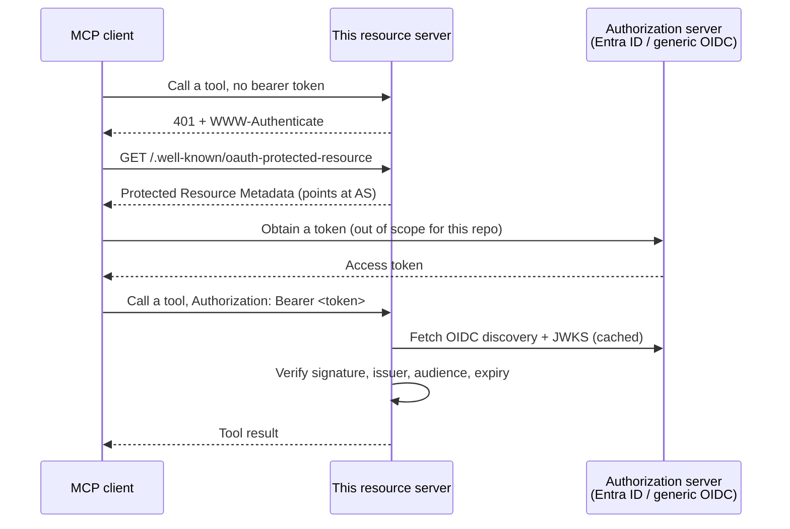

# Architecture

## Context

This service is a reusable template for an MCP server that acts as an OAuth 2.1 **resource
server** (RFC 9728) - it never issues tokens itself. Its one job is verifying bearer tokens a
client already obtained and translating their claims into the identity the server's tools see. See
`docs/adr/0002-oauth21-resource-server.md` for why token issuance is out of scope.

- **Upstream dependency**: exactly one authorization server per deployment - either Microsoft
  Entra ID or any standards-compliant OIDC authorization server (Auth0, Keycloak, WorkOS AuthKit,
  ...), selected by `MCP_SERVER_AUTH_PROVIDER`. This service reads the AS's OIDC discovery document
  and JWKS to verify signatures; it never calls the AS's token endpoint.
- **Downstream dependency**: MCP clients (2026-07-28 spec) that discover this server's Protected
  Resource Metadata at `/.well-known/oauth-protected-resource`, obtain a token from the configured
  AS, and call the registered tools (`whoami`, `health`) with that token as a bearer credential.
- **Companion repository**: [`mcp-client-auth-template`](https://github.com/brunovicco/mcp-client-auth-template)
  owns the client-side half of this pattern (token acquisition, client registration).

## Layers

```text
src/mcp_server_auth_template/
├── domain/
├── application/
├── adapters/
└── entrypoints/
```

### Domain

Pure business concepts, invariants, Value Objects, domain services, events, and domain errors.

### Application

Use cases, commands, queries, ports, authorization decisions, and transaction coordination.

### Adapters

Implementations of application ports for databases, messaging, HTTP, cache, storage, identity, and external SDKs.

### Entrypoints

HTTP, CLI, jobs, events, and serverless handlers. Entrypoints validate and translate transport data but do not own business rules.

## Dependency rule

```text
entrypoints -> application -> domain
adapters    -> application/domain
domain      -> no outer layer
```

## Cross-cutting decisions

- Configuration: environment variables validated at startup.
- Logging: structured events to stdout/stderr.
- Tracing: the service-only OpenTelemetry adapter exports trace data over OTLP HTTP/protobuf only
  when an endpoint is configured. It propagates W3C Trace Context, but not baggage, and keeps the
  SDK lifecycle at the composition-root boundary. The separate Langfuse LLM observer remains an
  opt-in adapter with its existing contract.
- Errors: infrastructure errors translated at adapters; external errors mapped at entrypoints.
- Time: UTC internally with timezone-aware values.
- Money: `Decimal` wrapped in a domain Value Object.
- Idempotency: required for externally visible side effects.
- Packaging: containerized via the repo `Dockerfile` (multi-stage, uv-based); the runtime `CMD` is defined per project.

## Diagrams

Resource-server bearer-token flow (the only critical flow this service owns; token issuance
happens entirely on the authorization server and is out of scope):


